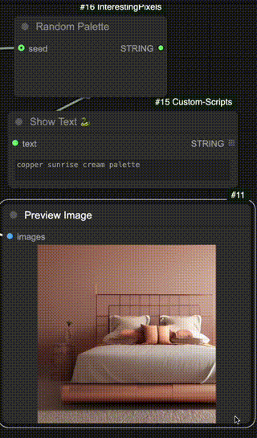

# Comfy-InterestingPixels

A collection of utility nodes for ComfyUI.

## Nodes

### ImageSlider
Generates a shareable link to compare two images side-by-side using an interactive slider.

**Features:**
- Automatically uploads images to server and generates URL
- Interactive slider for easy comparison
- Shareable link for collaboration

**Note:** Uploaded images are:
- Publicly accessible 
- Automatically deleted after 24 hours
- Can be used in any context

### RandomPalette
Generates random color palettes from a curated list of predefined options.

**Features:**
- Pre-selected harmonious color combinations
- Random selection for inspiration
- Easy integration into workflows
